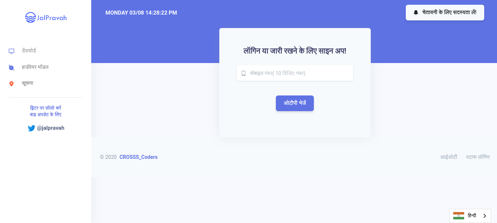

# JalPravah (Mobile App)(LN397 CROSS_Coders)

###### One Solution For All Dams


### Develop Backend

```bash
#Copy .env file from .env example
cp .env.example .env

# Create a database (with mysql or postgresql)
# And update .env file with database credentials
# DB_CONNECTION=mysql
# DB_HOST=127.0.0.1
# DB_DATABASE=hackathon
# DB_USERNAME=root
# DB_PASSWORD=root

# Install PYPI dependencies
pipenv install

#run application
flask run

#run fetch dam  (All information of dam store in dam.csv will be updated in databse)
flask dam fetch

#run fetch locatiom (All location of dam is fetchedbe updated in databse)
flask dam location

```

### Run Using Docker

```bash
#buid docker image
docker build --pull --rm -f "Dockerfile" -t sih:latest "."

# run container
docker run -rm -it -p 80:5000 sih:latest

```

### Develop Frontend

```bash
#Copy .env file from .env example
cd frontend

#install dependencies
yarn install

#run application
yarn run serve

```

### Hosted

[AWS Backend](https://api.pushpak1300.me/)
[Frontend](https://jalpravah.pushpak1300.me/)

### Screenshots





